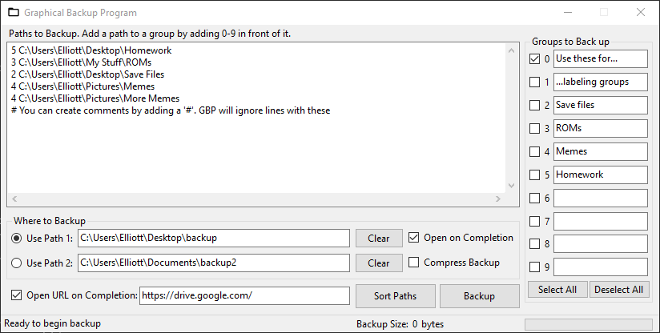

# Graphical-Backup-Program
## What is GBP? 🤔
On my main PC, I like to run a full PC backup occasionally. In addition, I like to back up my "super important" folders to an external location like Google Drive. Things like video game save files, etc. I like to have extra backups of super important stuff like this. It is also nice if I need these files on another PC, I can grab them from the cloud easily. I used to have to do this manually, hunting down every folder and file on my PC. But now, I just push a button, and they're all copied to a folder and opened automatically.

Graphical Backup Program (GBP) is a significantly improved version of [Folder Copy (FC)](https://github.com/ellman12/Folder-Copy). FC was pretty bad, but it got the job done. FC also had a lot of dumb: It was a command line tool, I went with Python as the language, and it could only backup folders. My original plan was to modify FC to be able to do files, but I put that off for a while, and eventually decided to create a whole new project with a GUI. It was originally going to be called FC2 (terrible name). Eventually, I came up with Graphical Backup Program (GBP), which I think is a much better (albeit fairly generic) name. A program called Folder Copy that can do both doesn't really make much sense.

One nice thing about GBP is that it saves the items you want backed up to a file so you don't have to re-enter it each time you run a backup. It also has a config file that stores your preferences. These are both stored in the project directory, and if they don't exist, it automatically creates them on startup and applies the default values.

## Returning Features From Folder Copy
* Backup folders (obviously)
* Ability to clear the backup folder before backing up to prevent old, unnecessary backups from consuming disk space
* Opens backup folder in File Explorer when backup completed. This allows you easy access to the folder for backing up to Google Drive or some other service, without having to go hunting for it each time a backup completes.
* Copy folders into a folder with a timestamp as its name so you can keep track of when you have made backups.

## New and Improved in Graphical Backup Program
* Easy-to-use GUI: No crappy command line "interface" here!
* Ability to backup files now
* Easily switch between 2 different backup locations
* Ability to add paths to "groups", allowing you significant control over what is backed up
* GBP's log/output is a lot better than FC's
* Compress backup into a .zip
* Open a URL (like Google Drive) on backup completion
* Displays backup size in GUI
* GBP performs significantly faster than FC, even when copying large folders (just be warned, if you throw large folders at GBP, it will massively slow down your PC and GBP will act like it is frozen, but it's not. Just be patient.)

## How to Compile Into a Portable .exe
You shouldn't need to do this, but I figured I should include this in the README. 
The way I compiled this into a portable .exe for the GitHub release was by running this command inside `/Graphical-Backup-Program/Graphical Backup Program`: 
`dotnet publish -o GBP -r win-x64 /p:PublishSingleFile=true`
 (Thanks [@pythondude325](https://github.com/pythondude325))

## How to Install and Setup
<b>Install .NET first. GBP requires it.</b>

Running GBP is easy. Just download the Program.zip from GitHub, add the GBP folder to someplace like `C:\Program Files\`, and run the .exe. GBP should run without any issues. You can then pin the .exe to the Start menu, create a Desktop shortcut, or whatever you want to easily access GBP whenever you want.

## Contributing
Feel free to open a PR or shoot me a message if you have ideas for GBP or you spot a bug 🐛.
 

GBP icon from [Google Material Icons](https://fonts.google.com/icons?selected=Material%20Icons%20Outlined%3Afolder_open)
